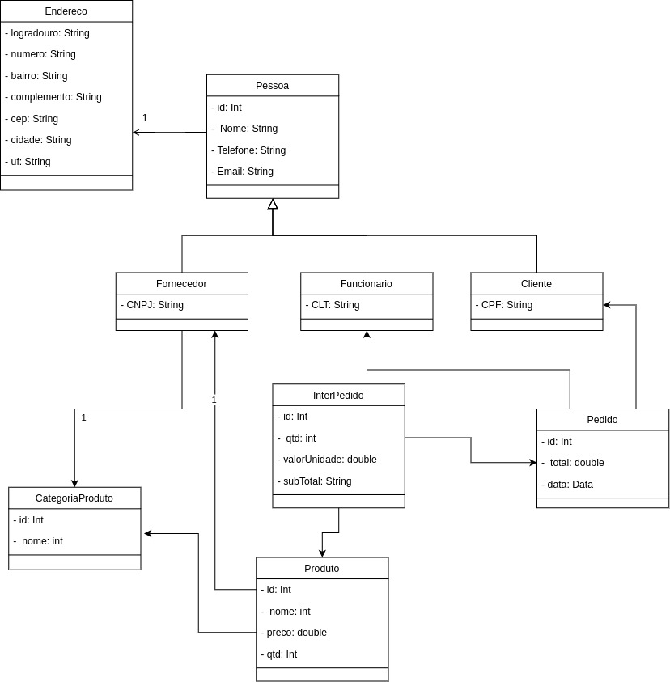

# Desafio de Criação de Software de Gerenciamento de Mercearia

## Escopo:

1. Criação, alteração e remoção dos seguintes itens:
    - Categoria (exemplo: Frutas, Bebidas...)
    - Produto (Nome, Preço, Categoria, Quantidade = 1000) (exemplo: arroz; 23,99; alimentos; 1000)
    - Fornecedor (CNPJ, Nome, Telefone, Endereço, e-mail, categoria) (exemplo: 12.345.678/0001-23, Jõao LTDA, (11) 1234-5678, Rua A, joao@abc.com, padaria)
    - Cliente (CPF, Nome, Telefone, Endereço, e-mail) (exemplo: 123.456.789-12, Maria, (11) 1234-5678, Rua Ali, maria@abc.com)
    - Funcionário (CLT, Nome, Telefone, Endereço, e-mail) (exemplo: 123.456.789-12, Pedro, (11) 1234-5678, Rua Aqui, pedro@abc.com)

2. Sistema de Venda dos produtos

3. Relatórios:
    - Total de vendas
    - Vendas por data
    - Produtos mais vendidos
    - Clientes que mais compraram

## Desenvolvimento:

1. Implementação de uma interface
2. Armazenamento dos dados
3. Cada tabela deve possuir de 3 a 10 registros
4. Verificar inconsistência nos campos de CNPJ, CPF e CLT (quantidade de números digitados) e formatação (receber em formato numérico e demonstrar em forma de texto)
5. Evitar duplicidade de dados
6. Alertas (principalmente no estoque quando estiver abaixo de 300 itens) e possíveis ações a serem tomadas (no caso do estoque, informar contato do respectivo fornecedor)

O Sistema pode ser desenvolvido utilizando todos os conhecimentos em linguagem de programação, banco de dados e frameworks.

## Observações:

O objetivo deste desafio é criar um software de gerenciamento de mercearia com as funcionalidades e requisitos listados acima. Recomendamos utilizar as melhores práticas de programação e focar na usabilidade, eficiência e segurança do sistema.

### Modelo entidade relacionamento (MER):

### Mapeamento Objeto Relacional (ORM):

## Tecnologia Utilizada:
- Java 8
- Spring Boot 2.7.13
- MySQL
- Lombok
- Swagger